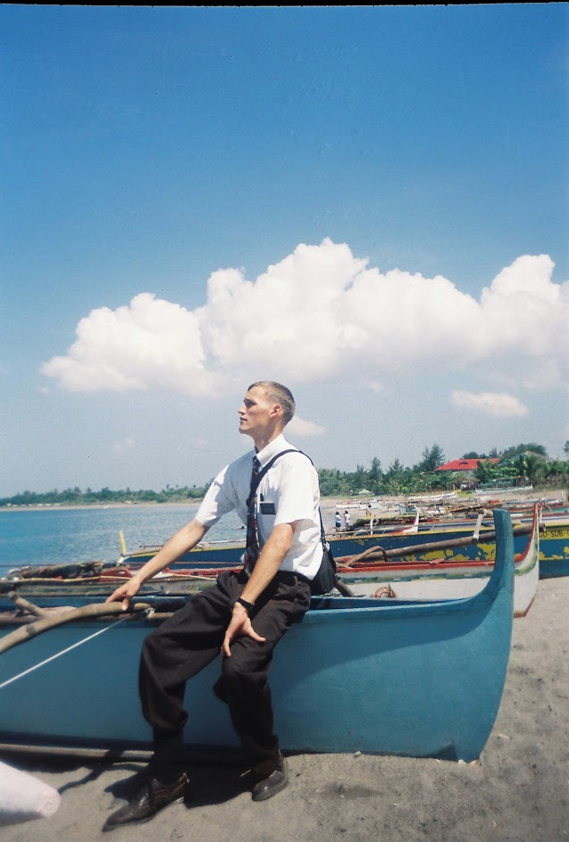

Here are some interesting things from my former life.

## Film

I worked as first assistant director on a full-length student film. With a handsome cameo as well (see if you can spot me in the white truck at 16:40). Beautiful. Emotionally heavy, but beautiful.

<iframe width="560" height="315" src="https://www.youtube-nocookie.com/embed/5KsFo4XtPR0" title="YouTube video player" frameborder="0" allow="accelerometer; autoplay; clipboard-write; encrypted-media; gyroscope; picture-in-picture" allowfullscreen></iframe>

# Church work

I served a two-year mission in the Philippines for my [church](https://www.churchofjesuschrist.org/comeuntochrist) at age 19. That's where I learned Tagalog.

I also served as the bishop (pastor) of our local congregation in Makati. Wonderful people.

# Art

I received my undergraduate degree in visual art. Joined a student art show in Aukland. (Where did that sculpture end up?) Enjoyed a six-week field studies in New Zealand and Tonga.

# Performance

I performed improv comedy professionally (I guess as professional as it gets?) at [ComedySportz](https://www.comedysportzutah.com/). I even tried a bit of stand-up. Whew! 

# Shiny

Adapted a cool [math game](https://tomhiatt.shinyapps.io/math_game/) for my son.

Also made a [UN meeting cost calculator](https://tomhiatt.shinyapps.io/InternalMeetingCost/) for reasons completely unrelated to my opinion of how useful meetings are.

