Digital solutions for health and health in digital solutions
========================================================
author: Tom Hiatt
date: October 2020
autosize: true
transition: linear

========================================================

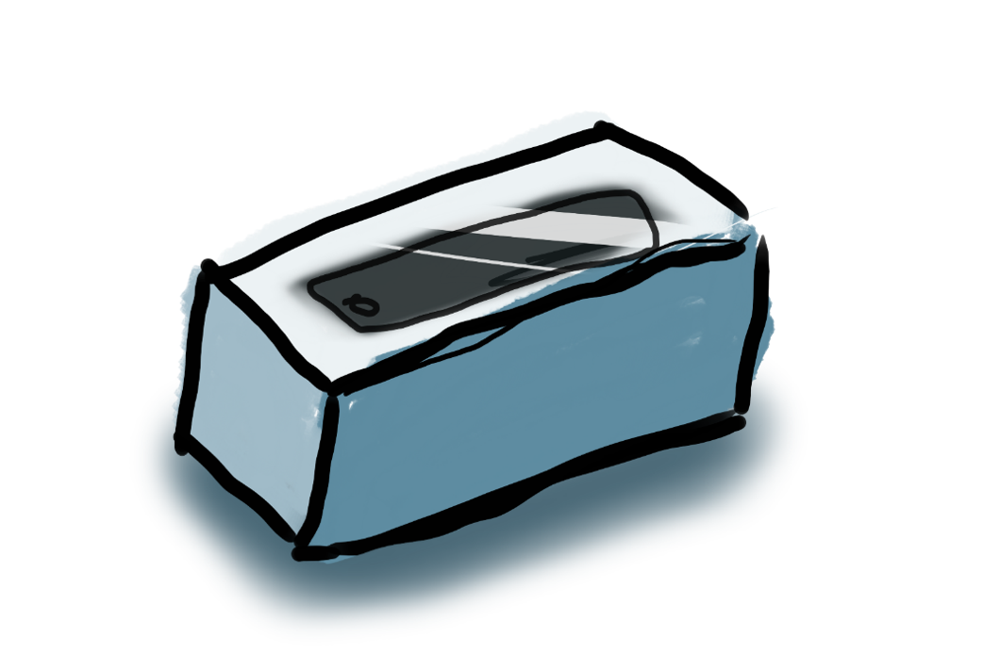
***
A few weeks ago, I sat down to unbox my new cellphone.

========================================================
<!-- transition: fade -->

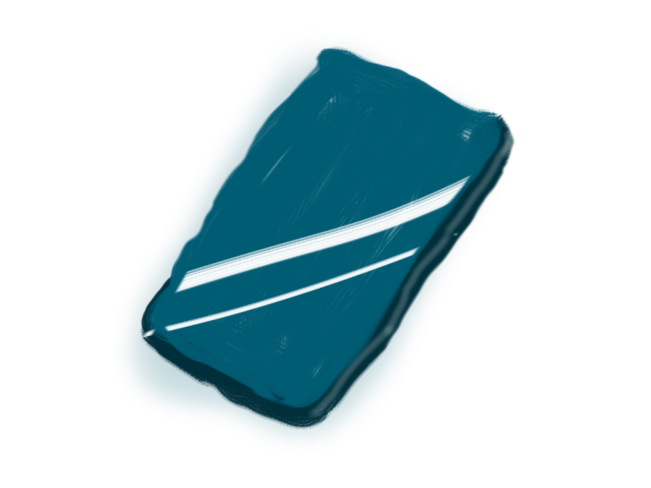
***
Some very clever designers have orchestrated that whole experience.  

From the beautiful box that it comes in, to the sleek black screen, to the perfectly fitted accessories, it made me feel like I had taken a time machine into the future.  

I sat at my desk as if I were a 6-year-old sitting under the Christmas tree!

========================================================
<!-- transition: fade -->

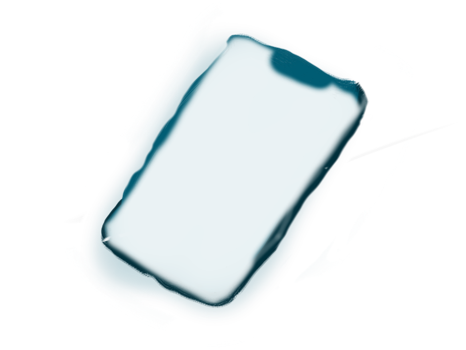
***
In awe, I turned on my new phone and the experience seamlessly transitioned from the physical world to the virtual. 

========================================================
<!-- transition: fade -->

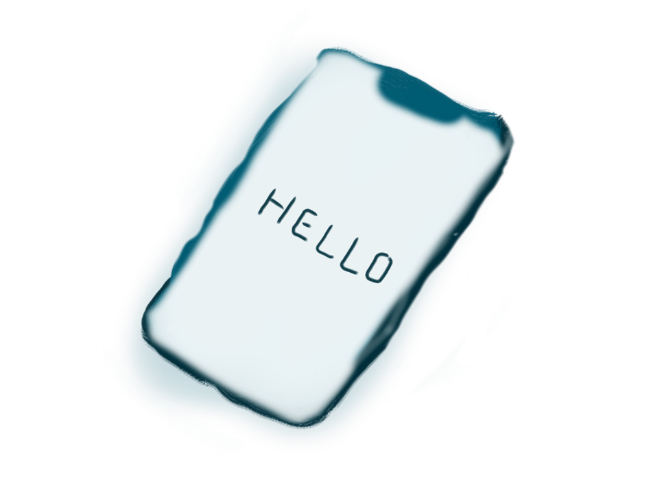
***
My phone greeted me kindly and then effortlessly synced everything from my previous phone. 

========================================================

***
As I browsed the capabilities of my new phone, I saw “exposure notifications”.  

This new feature was famously created by the unlikely partnership of Apple and Google. The feature tracks your proximity to other phones nearby that also have this feature turned on.

========================================================

Have you ever had a moment where you think “whoa! I’m in the future!”? This was one of those moments for me.  

So, am I to understand that we can use digital technology to log my interactions with others, mirroring the potential paths a virus like SARS-CoV-2 can take to hop from person to person? Is that correct?  

That’s amazing!

========================================================

***
My amazement continued as I looked at the health apps, my personal health profile with emergency contact, allergies, blood type, the ability to sign up for organ donation, tracking of steps, sleep, meals and more, and an expansive personal health record that can bring in my health data from various clinics and hospitals.  

Wow! Welcome to the future!

========================================================

***
I am an epidemiologist at the World Health Organization. At WHO we are interested in improving all aspects of health for all people. 

========================================================

***
This includes people in every far-flung corner of the world. This includes people of all different abilities, cultures and backgrounds. This includes people who can’t afford basic necessities, much less a fancy new smart phone.  

At WHO we’ve been working on the health of humans for 72 years. Long before the cell phone was invented.

========================================================

***
Whatever the era, we’ve always sought how to use the latest technologies to save and improve lives.

========================================================

***
I met Maria a few years ago in Cavite. I’ve changed her name and face to protect her identity. She was diagnosed with drug-resistant tuberculosis. Now if you don’t know, this disease is a killer. Literally. The treatment is so difficult, for some it’s as bad as death. 

========================================================

***
Every day during her treatment, Maria would wake up...  
go outside her home...  
hail a tricycle...  
ride it to a waiting shed...  
to then connect with a bus...  
and commute to a hospital, two hours away.

========================================================

This was the only place her drugs were available. These drugs were so expensive and the regimen so challenging, that health workers were required to observe every pill going down Maria’s throat. These drugs had horrible side-effects, but were the only thing available that could take on these mutant superbugs.  

It was a morbid game of who could kill whom first. 

========================================================

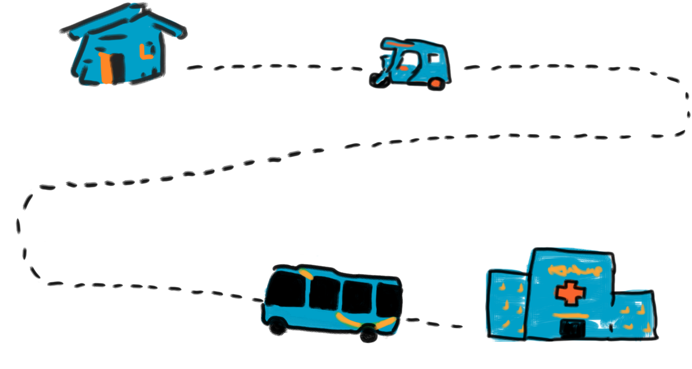
***
After the day’s microscopic battle, Maria would again board a bus...  
to take a tricycle...  
back to her home again to rest. Same thing the next day. And the next.  
Maria continued this not for a week, not for a month, but for two years. She finally finished her last drug and was declared TB-free.  

========================================================

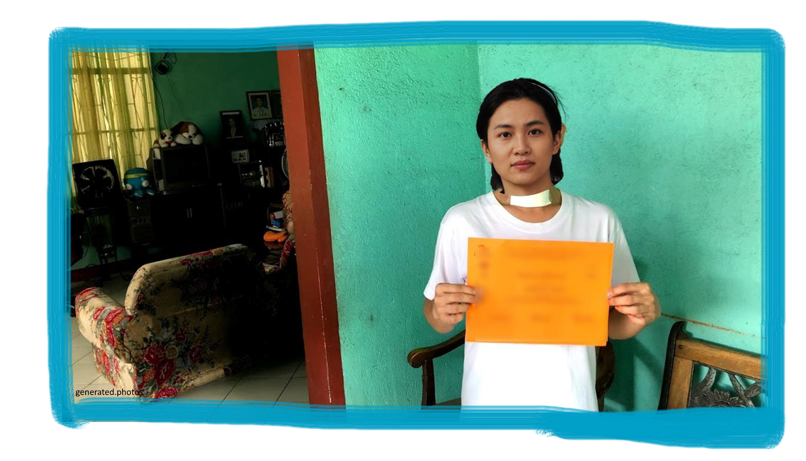
***
The sheer tenacity of patients like her amazes me.

========================================================
<!-- transition: fade -->

***
Later, her son Danny was diagnosed with the same drug-resistant bacteria. 

========================================================

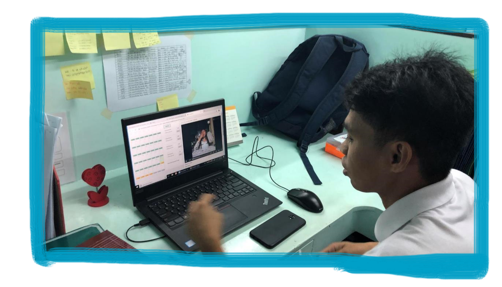
***
But this time it was different.  

The drugs were not much better, but the hospital now had the ability to oversee his treatment digitally, from a distance through a computer screen. He no longer needed to commute four hours a day to get well. It was still an immense undertaking for him to be sure, but far more manageable than for his mother.

========================================================

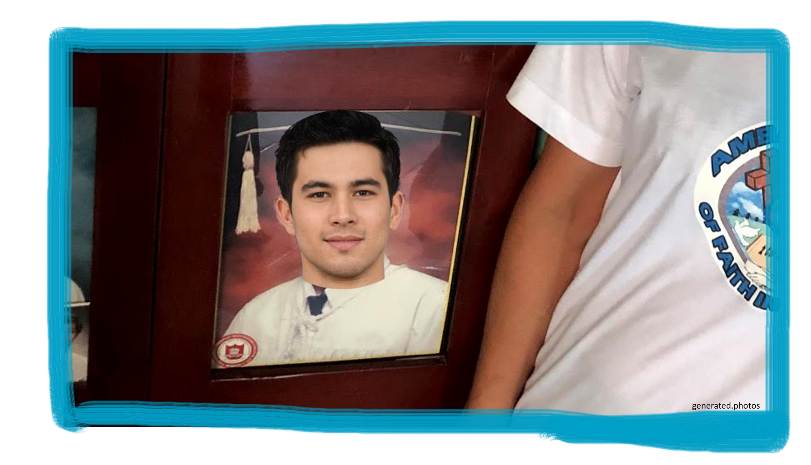
***
Would he have given up if he had to do what his mother did? Or did digital technology actually save his life?

========================================================

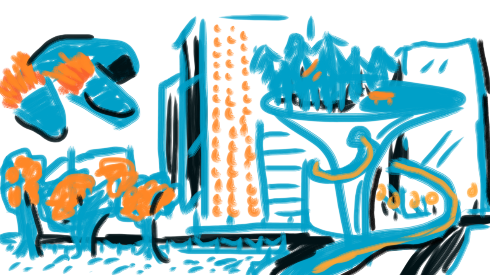
***
I love the work you all do in digital technology because you live in the future. You design not just the apps and features, but the entire architecture and standards that the world will function in digitally. 

========================================================

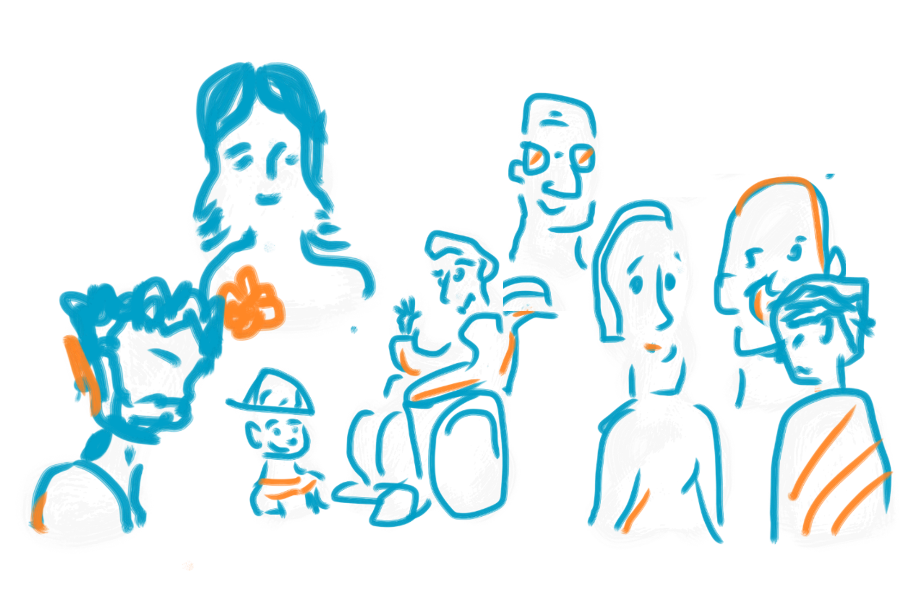
***
And so what about health? Our health and that of others? I might say that the improvement of the health of others, or public health, is one of the most noble pursuits we can follow in our time here on earth.  

What can we do to help the Marias and Dannys of the Philippines and of the world? 

========================================================

***
Earlier this year, I requested Philippine telecom providers to give free access to COVID KAYA, the COVID-19 information system of the Department of Health. They enthusiastically supported this initiative. Along with their partners they stood at the ready to help in any way they could to combat this pandemic in the Philippines.  

That is impressive to me. These organizations offered their unique strengths and abilities for a greater cause. 

========================================================

***
Please take a moment to reflect on your own company or organization. What can you contribute?  

Perhaps it is increasing internet coverage to the furthest corners of the country rather than just focusing on the densely-populated cities. 

========================================================
<!-- transition: fade -->

***
The United Nations Development Program is helping the Department of Information and Communications Technology to roll out free WiFi to 6,000 last mile communities across the country. 

========================================================

***
Imagine how that will save and improve lives.  

Perhaps you’re expanding telemedicine options to the elderly so they can get the care they need without the risk of being infected. Telemedicine partners of the Department of Health are making this a reality, SeeYouDoc, CloudPx, and HealthNowPH are a few examples.Maybe you’re helping to re-orient personal health data so the patient owns and controls it rather than the hospital.  

========================================================
<!-- transition: fade -->

***
You know best what you can do. 

========================================================

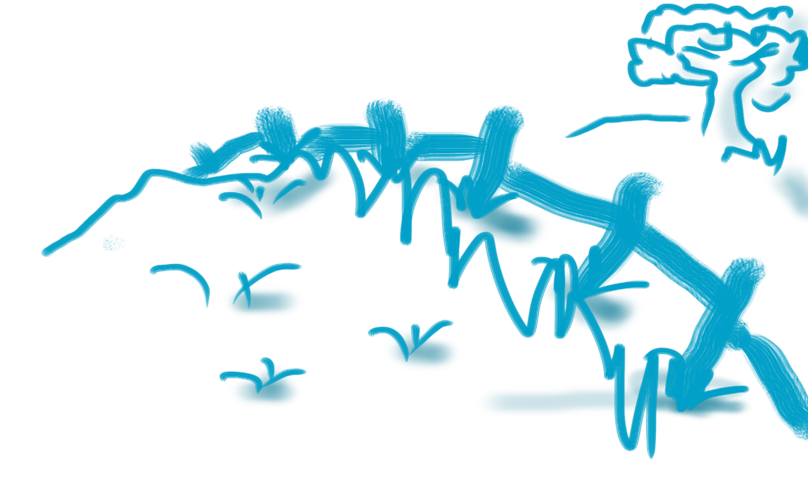
***
And when you see the limits of what you can do, I encourage you to look just beyond those limits. What would be a stretch, a risk, maybe even a loss, but would be of public benefit to your fellow humans?  

Find out and then find a way to go for it. I’m sure you can. Saving lives and improving them at the same time.

========================================================

***
Now just a word of caution. A plea, actually.  

As you develop the next big thing, whatever it is. Please. Please consider the health of your clients and customers, especially their mental health. 

========================================================
<!-- transition: fade -->

***
We’ve learned a lot in the social media era. If we could go back to 2003, maybe we’d design things differently. Maybe we’d make the like button a bit less addictive. Maybe we’d make the comparison with other people not as easy and abundant. Maybe we’d set limits on the way other companies use our platforms to ensure healthy customer engagement that’s not excessive.  

========================================================
<!-- transition: fade -->

***
We learned long ago that the way newspapers report suicide can either lead to more suicides or fewer suicides.  

We’re just starting to learn these lessons now for social media. 

========================================================

Again, as you create tomorrow’s digital solutions, please keep health in mind. Consult WHO guidance on screen time for children, the dangers of a sedentary lifestyle, gaming disorder and many other applicable references. 

See how you can orient toward better health instead of away from it.  

When you do, you may be an unsung hero, as no one will know just how bad it could have been, but that is the way of public health. No one knows all the pandemics that didn’t happen. But you’ll know. And your people will know. And I believe, in the long run, your customers and clients will feel that you fundamentally care for them, even if they don’t quite know why.

========================================================

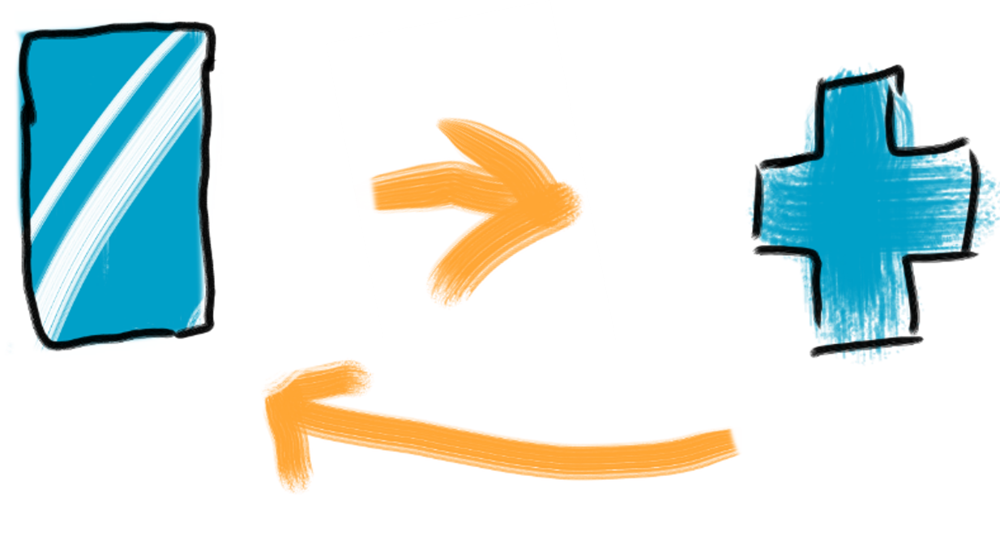
***
So, your role is two-fold...    

digital solutions for health and health in all your digital solutions. 

========================================================

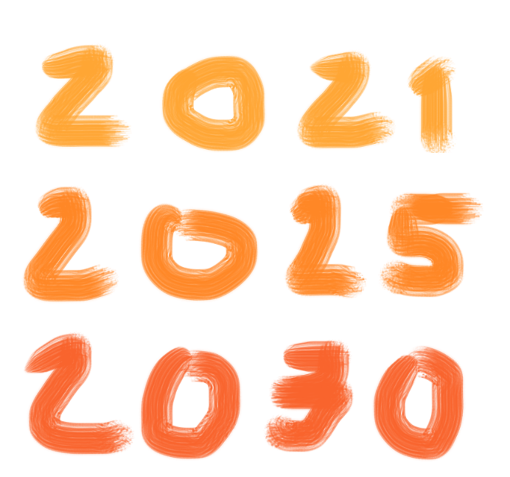
***
What will 2021 look like for digital health?  

2025?  

2030? 

========================================================

***
How will we take on threats to health, big and small?  

Tuberculosis, HIV, new diseases like COVID-19, traffic accidents, heart disease, cancer?  

What digital tools will be available to doctors, nurses and patients thanks to your efforts today?

========================================================

***
It makes me excited just thinking about it!  

Saving people’s lives and improving their lives at the same time.  

Can anything be more meaningful than that?  

Thank you!

