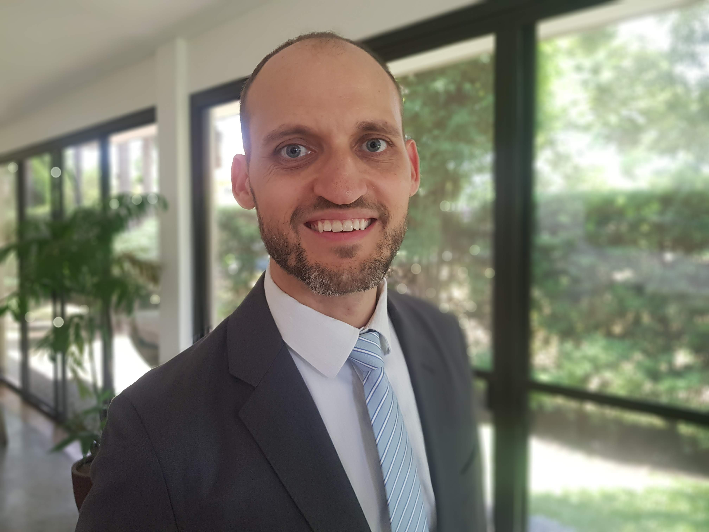

<link rel="stylesheet" href="styles.css" type="text/css">
<link rel="stylesheet" href="academicicons/css/academicons.min.css"/>

I am an epidemiologist and digital health expert providing applied solutions for public health. I currently work at the [World Health Organization](https://www.who.int/). I've been serving the member countries of WHO since 2007 at the headquarters office in Geneva, Switzerland, as well as the Regional Office for the Western Pacific and the Philippines and Uzbekistan Country Offices. I earned a master’s degree in epidemiology from the London School of Hygiene and Tropical Medicine after completing my undergraduate work in art and film at Brigham Young University in the United States.

My work has covered a variety of areas in health. As part of the monitoring and evaluation team of the Global Tuberculosis Programme, I managed the data flow and analysis for five annual Global TB reports (even designing the cover art) I have promoted digital solutions for health data management and collaboration for rabies, leprosy, health systems and health emergencies. I am passionate about making data actionable to improve health and save lives. 

I've lived in the United States, Switzerland, the Philippines and Uzbekistan. I speak English, French, Filipino and am some Russian. I currently reside in the Philippines with my wife and children. 
