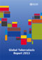

<link rel="stylesheet" href="styles.css" type="text/css">
<link rel="stylesheet" href="academicicons/css/academicons.min.css"/>

 &nbsp;   [Orcid](https://orcid.org/0000-0003-0056-1433)

# Research

## *Publications*

**Expansion of social protection is necessary towards zero catastrophic costs due to TB: the first national TB patient cost survey in the Philippines** Jhiedon L. Florentino, Anna Marie Celine Garfin, Rosa Mia L. Arao, Donna Mae G. Gaviola, Carlos R. Tan, Rajendra Prasad Yadav, Tom Hiatt, Fukushi Morishita, Andrew Siroka, Takuya Yamanaka, Nobuyuki Nishikiori  
Pre-print

**Deriving and validating scoring tools for identifying TB patients facing catastrophic costs due to TB in the Philippines** Takuya Yamanaka, Anna Marie Celina Garfin, Rosa Mia Arao, Fukushi Morishita, Tom Hiatt, Nobuyuki Nishikiori, Rajendra Prasad Yadav  
Pre-print

**Epidemiology and control of tuberculosis in the Western Pacific Region: update with 2013 case notification data** Hiatt, T. and Nishikiori, N.
Western Pacific surveillance and response journal : WPSAR
2016 | journal-article
DOI: [10.5365/WPSAR.2015.6.4.010](https://doi.org/10.5365/WPSAR.2015.6.4.010)

**Outcomes of Category I and II regimens in mono-and polyresistant tuberculosis cases in the Philippines** Lew, W.-J.
Harrington, K.
Garfin, C.
Islam, T.
Hiatt, T.
Nishikiori, N.  
International Journal of Tuberculosis and Lung Disease
2016 | journal-article
DOI: [10.5588/ijtld.15.0292](https://doi.org/10.5588/ijtld.15.0292)

**Drug-resistant tuberculosis in the WHO Western Pacific Region** Islam, T.
Hiatt, T.
Hennig, C.
Nishikiori, N.    
Western Pacific surveillance and response journal : WPSAR
2014 | journal-article
DOI: [10.5365/WPSAR.2014.5.4.007](https://doi.org/10.5365/WPSAR.2014.5.4.007)

**Epidemiology and control of tuberculosis in the Western Pacific Region: analysis of 2012 case notification data** Hiatt, T.
Nishikiori, N.  
Western Pacific surveillance and response journal : WPSAR
2014 | journal-article
DOI: [10.5365/WPSAR.2014.5.1.013](https://doi.org/10.5365/WPSAR.2014.5.1.013)

**Market size and sales pattern of tuberculosis drugs in the Philippines** Islam, T and van Weezenbeek, C and Vianzon, R and Garfin, AMCG and Hiatt, T and Lew, WJ and Tisocki, K   
Public health action 
2013 | journal-article

# *Monitoring and Evaluation*

**Global tuberculosis report 2013**  
Geneva, Switzerland: World Health Organization  
2013   
   

**Global tuberculosis report 2012**  
Geneva, Switzerland: World Health Organization  
2012   
  

**Global Tuberculosis Control 2011**  
World Health Organization: Geneva  
2011  
  

**Global tuberculosis control 2010**  
World Health Organization: Geneva, Switzerland  
2010  
  

**Global tuberculosis control 2009**  
a short update to the 2009 report  
World Health Organization: Geneva, Switzerland  
2009 
  

**Global tuberculosis control 2009**  
epidemiology, strategy, financing. WHO report 2009
WHO Press  
2009  
  

# *Master's Thesis*

**Neighbourhood-level risk factors and social determinants for tuberculosis disease in Metro Manila, Philippines: an ecological study using census and notification data** 
 
[View PDF](files/Thesis.pdf)

